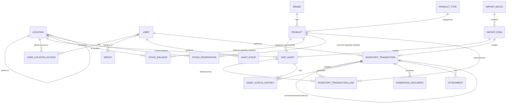

# Data Model

Covers spec §5–§8, §18. Two design decisions here diverge from the *literal* entity list in spec §18 (which is
introduced as "suggested"); both are explained inline and are reversible without touching business rules — flagged
again in [10-assumptions-and-open-questions.md](10-assumptions-and-open-questions.md).

## Entity-relationship diagram

## Location hierarchy: one self-referential table, not six

Spec §18 lists `Country, Site, Floor, StorageRoom, RackCabinet, ShelfBin` as separate entities. This plan instead
uses a **single `Location` table** with a `level` enum and a self-referential `parent`, for three reasons that all
trace back to explicit spec rules:

- "Lower location levels are optional. An item may be recorded only at country, site, or room level" (§7) is trivial
  with one table (a `UnitAsset.current_location` FK just points at whichever node exists) but awkward with six
  tables (would need six nullable FKs on every location-bearing row).
- "The schema... must support multiple countries" (§7) and permission grants at "one or more country/storage scopes"
  (§4) are both naturally expressed as "grant access to a `Location` node; access cascades to its descendants" —
  one join instead of a six-way union.
- Bulk transfer and scoped search need fast "is this location under that node" checks. PostgreSQL's `ltree`
  extension (built in, no extra service) stores a materialized path per node and answers ancestor/descendant
  queries with an index instead of a recursive CTE.

The fixed ordering (Country → Site → Floor → Storage Room → Rack/Cabinet → Shelf/Bin) is still enforced — see
constraints below — so this is a storage-layout change only, not a relaxation of the business rule.

## Entities

### `Location`

| Field | Type | Notes |
|---|---|---|
| `id` | UUID PK | |
| `parent_id` | FK → `Location`, null | null only for `level='country'` |
| `level` | enum: `country, site, floor, storage_room, rack_cabinet, shelf_bin` | |
| `name` | varchar(120) | |
| `code` | varchar(30), optional | short label for printable forms |
| `path` | `ltree` | materialized ancestor path, maintained by a `BEFORE INSERT/UPDATE` trigger from `parent_id` |
| `is_active` | boolean, default true | |
| `created_at`, `updated_at` | timestamptz | |

**Constraints**
- `UNIQUE (parent_id, level, lower(trim(name)))` — case/whitespace-insensitive uniqueness among siblings.
- `CHECK`: `level='country'` ⇒ `parent_id IS NULL`; every other level ⇒ `parent_id IS NOT NULL`.
- A `BEFORE INSERT/UPDATE` trigger rejects a `parent`/`level` pair where the parent's `level` is not the immediate
  predecessor in the fixed ordering (plain `CHECK` constraints cannot reference another row, so this needs a
  trigger or — equivalently — the `LocationService.create()` function being the *only* write path, enforced by
  revoking direct `INSERT`/`UPDATE` on this table from the application DB role for any level column outside that
  service). Recommendation: trigger, so the invariant holds even against a future raw migration or admin script.

**Indexes**: GiST index on `path` (ancestor/descendant queries), btree on `(level, is_active)`, btree on `name` for
autocomplete.

**Deletion policy**: never hard-deleted while any `UnitAsset`, `StockBalance`, `StockReservation`, or
`InventoryTransactionLine` references it (enforced by `PROTECT` on those FKs). `is_active=false` is the only
supported way to retire a location; it remains visible in history and reports.

### `UserLocationAccess`

| Field | Type | Notes |
|---|---|---|
| `id` | UUID PK | |
| `user_id` | FK → `User` | |
| `location_id` | FK → `Location`, `PROTECT` | grant point; access includes all descendants via `path` |
| `granted_by_id` | FK → `User` | |
| `granted_at` | timestamptz | |

`UNIQUE (user_id, location_id)`. Role (Administrator / Stock Manager / Read-only) is **not** stored here — it comes
from Django `Group` membership. This table only answers "which locations." See
[04-permission-matrix.md](04-permission-matrix.md) for how the two combine. Administrators need no grant rows at
all: `is_administrator(user)` (membership in the `Administrator` group, or `is_superuser`) grants access to every
location directly, so there's no separate `all_locations` flag to keep in sync and no grant update needed when a
new country is added.

### `Brand`

`id` (UUID), `name` (unique, normalized on lower/trim), `is_active`. Minimal — brands are a flat lookup, unlike
locations.

### `ProductType`

`id`, `name` (unique, normalized), `is_active`. A lightweight lookup table (not free text) so the "Type" filter in
spec §14 stays a fast indexed `IN` query and a controlled vocabulary, while still letting Administrators add new
types without a deploy. Seeded with the categories the spec names as typical: Firewall, Switch, Server, HDD, Toner,
Keyboard, Accessory, Other.

### `Product`

| Field | Type | Notes |
|---|---|---|
| `id` | UUID PK | |
| `brand_id` | FK → `Brand`, `PROTECT` | |
| `model` | varchar(120) | required |
| `sku` | varchar(60), optional | |
| `normalized_model`, `normalized_sku` | generated (lower/trim/collapse-whitespace) | used only for duplicate detection, not shown to users |
| `product_type_id` | FK → `ProductType`, `PROTECT` | required |
| `description` | text, optional | |
| `tracking_method` | enum: `unit`, `quantity` | immutable once movements exist (see below) |
| `supplier` | varchar(120), optional | free text, not a master-data FK (spec §2.6) |
| `default_notes` | text, optional | |
| `is_active` | boolean, default true | |
| `low_stock_threshold` | integer, null | only meaningful when `tracking_method='quantity'`; `CHECK` enforces null when unit-tracked |
| `created_by/at`, `updated_by/at` | | |

**Constraints**
- No DB-level uniqueness on `(brand, model, sku)` — the spec requires duplicates be *detectable and acknowledgeable*,
  not blocked (§2.6, §6). Enforced instead by a service-layer check (see
  [05-tracking-and-duplicates.md](05-tracking-and-duplicates.md)).
- `CHECK (tracking_method <> 'unit' OR low_stock_threshold IS NULL)`.
- **Tracking-method lock**: once any `UnitAsset` or `StockBalance`/`InventoryTransactionLine` row references this
  product, `ProductService.update()` rejects a `tracking_method` change; only `ProductService.migrate_tracking_method()`
  (Administrator-only, itself a fully audited transaction that converts existing records) may change it, per spec §5.

**Indexes**: btree on `(normalized_model, normalized_sku)`, on `brand_id`, on `product_type_id`, on `is_active`.

### `UnitAsset` (unit-tracked inventory)

| Field | Type | Notes |
|---|---|---|
| `id` | UUID PK | internal only, never shown as an asset tag (§5, §18) |
| `product_id` | FK → `Product`, `PROTECT` | |
| `vendor_serial` | varchar(120), optional | |
| `normalized_serial` | generated (upper/trim/collapse-whitespace), indexed, **not unique** | duplicate detection input |
| `status` | enum (see [03-status-and-movement-rules.md](03-status-and-movement-rules.md)) | denormalized current state — see rationale below |
| `current_location_id` | FK → `Location`, null, `PROTECT` | |
| `project_reference` | varchar(120), optional | manual text |
| `final_customer` | varchar(120), optional | manual text |
| `supplier` | varchar(120), optional | |
| `invoice_number` | varchar(60), optional | |
| `arrival_date` | date | |
| `condition` | enum: `new, good, fair, damaged, unknown` | see open question in doc 10 — exact vocabulary not specified by spec |
| `accessories` | text | free-form list (e.g. "power cable, mounting kit") |
| `notes` | text, optional | |
| `last_removal_date` | date, null | set by the movement that removes it from storage; preserved through a later return (§8) |
| `created_by/at`, `updated_by/at` | | |

**Why `status`/`current_location` are columns, not a live query over the ledger**: the spec calls the ledger
authoritative ("current status and location are outcomes of recorded movements," §2.1) but also requires
sub-second filtered list responses at 100k+ rows (§17). Every write to these two columns happens inside the same
atomic transaction as the ledger row that causes it (`inventory/services/ledger.py`), so they are a
same-transaction denormalization, not a separately-maintained cache — there is one write path, so they cannot drift
from the ledger the way a truly independent cache could. A periodic reconciliation job (or an on-demand admin
"verify" action) can recompute both from `InventoryTransactionLine`/`AssetStatusHistory` and flag mismatches, the
same integrity-check pattern used for `StockBalance` (§6).

**Constraints**: `CHECK (status IN (...))`. No uniqueness on `vendor_serial`/`normalized_serial` (§5, §18 — explicit).

**Indexes**: btree on `normalized_serial`, `product_id`, `status`, `current_location_id`, `project_reference`,
`final_customer`, `arrival_date`, `last_removal_date`. Composite `(product_id, status)` for the common "available
units of this product" query used by reservation/assignment screens.

### `AssetStatusHistory`

A denormalized, append-only per-asset timeline — **not** an independent source of truth. Every row is written in
the same transaction as the `InventoryTransactionLine` that caused it, purely so the asset-detail screen can render
a clean timeline (`WHERE unit_asset_id = ?`) without joining the wider multi-line ledger.

| Field | Type |
|---|---|
| `id` | UUID PK |
| `unit_asset_id` | FK → `UnitAsset`, `CASCADE` only if the asset row itself is ever purged (it never is in practice — see deletion policy) |
| `transaction_id` | FK → `InventoryTransaction`, `PROTECT` |
| `from_status`, `to_status` | enum |
| `from_location_id`, `to_location_id` | FK → `Location`, null |
| `occurred_at` | timestamptz |
| `recorded_by_id` | FK → `User` |
| `notes` | text, optional |

Append-only (no `UPDATE`/`DELETE` in the app; see `audit` app's enforcement pattern, reused here).

### `StockBalance` (quantity-tracked inventory)

One row per `(product, location)` — see [10-assumptions-and-open-questions.md](10-assumptions-and-open-questions.md)
for why Project Reference/Final Customer are *not* dimensions of this table.

| Field | Type | Notes |
|---|---|---|
| `id` | UUID PK | |
| `product_id` | FK → `Product`, `PROTECT` | |
| `location_id` | FK → `Location`, `PROTECT` | |
| `on_hand_quantity` | integer | sum of ledger deltas at this (product, location) |
| `reserved_quantity` | integer | sum of active `StockReservation.quantity` at this (product, location) |
| `updated_at` | timestamptz | last ledger write that touched this row |

`available_quantity` is **not stored** — it is always `on_hand_quantity - reserved_quantity`, computed in the
query/service layer so it can never itself drift.

**Constraints**
- `UNIQUE (product_id, location_id)`.
- `CHECK (on_hand_quantity >= 0)`, `CHECK (reserved_quantity >= 0)`, `CHECK (reserved_quantity <= on_hand_quantity)`.
- Negative-balance / over-reservation prevention is primarily a service-layer check (with `select_for_update()`
  locking) so the user gets a clear error; the `CHECK` constraints are the last-resort database guarantee (§6, §17).
  An Administrator correction is the only path that may temporarily violate the "would go negative" business rule,
  and it does so by writing an explicit, audited correction ledger line — the stored balance itself never goes
  negative.

**Indexes**: `(product_id, location_id)` (covers the unique constraint), `location_id`.

### `StockReservation`

Tracks *why* a slice of a `StockBalance` is reserved, carrying the Project Reference/Final Customer the spec asks
for on "quantity stock" (§6), without fragmenting the balance table itself.

| Field | Type | Notes |
|---|---|---|
| `id` | UUID PK | |
| `product_id` | FK → `Product`, `PROTECT` | |
| `location_id` | FK → `Location`, `PROTECT` | |
| `quantity` | integer, `CHECK > 0` | |
| `project_reference` | varchar(120), optional | |
| `final_customer` | varchar(120), optional | |
| `status` | enum: `active, released, consumed` | |
| `created_by_id/at` | | |
| `reservation_transaction_id` | FK → `InventoryTransaction`, `PROTECT` | |
| `consuming_transaction_id` | FK → `InventoryTransaction`, null, `PROTECT` | set when converted to assignment/delivery |

**Indexes**: `(product_id, location_id, status)`, `project_reference`, `final_customer`.

### `InventoryTransaction` (ledger header)

| Field | Type | Notes |
|---|---|---|
| `id` | UUID PK | |
| `transaction_number` | varchar, unique, sequential | see numbering note below |
| `movement_type` | enum (§8, list in doc 03) | |
| `occurred_at` | date | business date (arrival/removal/delivery date entered by the user) |
| `created_at` | timestamptz | system timestamp, immutable |
| `performed_by_id` | FK → `User`, `PROTECT` | |
| `source_location_id` | FK → `Location`, null, `PROTECT` | null for receipts |
| `destination_location_id` | FK → `Location`, null, `PROTECT` | null for assignment/delivery/loss/disposal (leaves storage) |
| `project_reference`, `final_customer` | varchar, optional | header-level; lines snapshot these too (see doc 06) |
| `employee_name` | varchar, optional | assignment only |
| `is_temporary_assignment` | boolean, null | assignment only |
| `expected_return_date` | date, null | assignment only, informational (§9) |
| `notes` | text, optional | |
| `related_transaction_id` | FK → `InventoryTransaction`, null, self, `PROTECT` | points at the original transaction for a return/correction/reversal/reservation-consumption |
| `duplicate_serial_acknowledged` | boolean, default false | true if this transaction required and received serial-duplicate acknowledgement |

**Immutability**: rows are `INSERT`-only from the application's perspective. A "correction" or "reversal" is a new
`InventoryTransaction` row with `movement_type='correction'|'reversal'` and `related_transaction_id` pointing back;
the original row's business fields are never rewritten (§12). The DB role the app connects as has no `UPDATE`
grant on business columns of this table beyond what Django migrations need — enforced at the Postgres role level,
not just in application code, so a bug can't silently mutate history.

**Transaction numbering**: a Postgres `SEQUENCE` (`inventory_transaction_number_seq`) formatted as e.g.
`TXN-000001`. This is monotonic and unique but **not gapless** (a rolled-back transaction consumes a sequence
value). The spec asks for "unique sequential" numbers for printable documents (§10), not gapless numbers, so a
sequence is the standard, safe choice — a gapless scheme would require serializing all writes and would work
against the concurrency requirement in §17.

**Indexes**: `movement_type`, `performed_by_id`, `occurred_at`, `source_location_id`, `destination_location_id`,
`project_reference`, `final_customer`, `related_transaction_id`.

### `InventoryTransactionLine`

| Field | Type | Notes |
|---|---|---|
| `id` | UUID PK | |
| `transaction_id` | FK → `InventoryTransaction`, `PROTECT` | |
| `line_number` | integer | |
| `unit_asset_id` | FK → `UnitAsset`, null, `PROTECT` | set for unit-tracked lines |
| `product_id` | FK → `Product`, `PROTECT` | always set (also for unit lines, denormalized for query simplicity) |
| `quantity_delta` | integer | signed; `+1`/`-1` semantics for a unit line's status bookkeeping is not used — unit lines always carry `quantity=1` in the *display* sense; quantity-tracked lines carry the signed ledger delta (e.g. `-5` for a delivery, `+5` for a return) |
| `from_status`, `to_status` | enum, null | null for pure quantity movements that don't change a `UnitAsset.status` |
| `from_location_id`, `to_location_id` | FK → `Location`, null | |
| **Snapshot fields** (never re-read from `Product`/`UnitAsset` after creation): | | |
| `brand_snapshot`, `model_snapshot`, `sku_snapshot`, `type_snapshot`, `description_snapshot` | varchar/text | |
| `serial_snapshot` | varchar, null | unit lines only |
| `project_reference_snapshot`, `final_customer_snapshot`, `supplier_snapshot`, `invoice_number_snapshot` | varchar, null | |
| `condition_snapshot`, `accessories_snapshot` | varchar/text, null | |
| `notes` | text, optional | |

**Constraints**
- `CHECK`: (`unit_asset_id IS NOT NULL AND quantity_delta IN (-1, 1)`) OR (`unit_asset_id IS NULL AND product tracking_method = 'quantity'`) — the cross-table `tracking_method` part needs a trigger (same reasoning as the `Location` hierarchy check) or is enforced solely in `ledger.py`, which is the only writer. Recommendation: enforce in `ledger.py` and cover with tests; add the trigger only if a second write path ever appears.
- Quantity-tracked lines: `CHECK (quantity_delta <> 0)`.

**Indexes**: `transaction_id`, `unit_asset_id`, `product_id`, `project_reference_snapshot`, `final_customer_snapshot`.

### `GeneratedDocument`

| Field | Type | Notes |
|---|---|---|
| `id` | UUID PK | |
| `transaction_id` | FK → `InventoryTransaction`, `PROTECT` | |
| `document_number` | varchar, unique, sequential (own sequence, e.g. `DOC-000001`) | |
| `document_type` | enum: `assignment, delivery` | |
| `template_version` | varchar | identifies which HTML template rendered this file |
| `context_snapshot` | JSONB | the exact data passed to the template, for full reproducibility even if the template changes later |
| `pdf_file` | file path (protected volume) | |
| `generated_by_id` | FK → `User` | |
| `generated_at` | timestamptz | |

Never updated in place; "regenerate" creates a new row (see doc 06).

### `Attachment`

| Field | Type | Notes |
|---|---|---|
| `id` | UUID PK | |
| `transaction_id` | FK → `InventoryTransaction`, `PROTECT` | |
| `file` | file path (protected volume) | |
| `original_filename` | varchar | |
| `content_type` | varchar | validated against an allow-list |
| `size_bytes` | integer | validated against a configured max |
| `uploaded_by_id` | FK → `User` | |
| `uploaded_at` | timestamptz | |
| `is_deleted` | boolean, default false | soft-delete only, Administrator-only, itself audited |

Multiple attachments per transaction are allowed (a new upload is a new row — this is how "never overwrite an
existing attachment silently," §11, is satisfied).

### `ImportBatch` / `ImportRow`

| `ImportBatch` field | Type |
|---|---|
| `id` | UUID PK |
| `source_filename` | varchar |
| `file_checksum` | varchar (sha256) — flags re-upload of the same file |
| `uploaded_by_id/at` | |
| `column_mapping` | JSONB |
| `status` | enum: `uploaded, previewed, validated, executing, completed, failed, partially_completed` |
| `executed_by_id/at` | null until executed |
| `imported_count, skipped_count, warning_count, failed_count` | integer |

| `ImportRow` field | Type |
|---|---|
| `id` | UUID PK |
| `batch_id` | FK → `ImportBatch`, `CASCADE` |
| `row_number` | integer |
| `raw_data` | JSONB — original cell values, untouched |
| `normalized_data` | JSONB — after whitespace/date/serial normalization |
| `outcome` | enum: `pending, imported, skipped, warning, failed` |
| `outcome_detail` | text |
| `created_unit_asset_id`, `created_transaction_id` | FK, null |

`UNIQUE (batch_id, row_number)`. Idempotency: re-executing a batch skips any `ImportRow` whose `outcome` is already
`imported` (see doc 07 for the full retry algorithm).

### `AuditEvent`

| Field | Type | Notes |
|---|---|---|
| `id` | UUID PK | |
| `occurred_at` | timestamptz | |
| `actor_id` | FK → `User`, null | null only for unauthenticated login-failure events |
| `event_type` | enum (see doc 08) | |
| `object_type` | varchar | e.g. `"UnitAsset"` |
| `object_id` | varchar | |
| `summary` | text | |
| `old_values`, `new_values` | JSONB, null | |
| `metadata` | JSONB | e.g. matched duplicate IDs for a duplicate-serial acknowledgement |
| `ip_address` | inet, null | |

**Append-only**: the application DB role has no `UPDATE`/`DELETE` grant on this table (Postgres `REVOKE`), so even
a bug cannot rewrite history — matches "permanent deletion of inventory history or audit entries is prohibited
through the application" (§12) with a defense-in-depth guarantee beyond just "the ORM doesn't expose it."

**Indexes**: `(object_type, object_id)`, `actor_id`, `event_type`, `occurred_at`.

## Deletion policy summary

| Rule | Applies to |
|---|---|
| Never hard-deleted; `is_active=false` only | `Location`, `Brand`, `ProductType`, `Product` |
| Never deleted; append-only | `InventoryTransaction`, `InventoryTransactionLine`, `AssetStatusHistory`, `AuditEvent`, `GeneratedDocument` |
| Soft-delete only (`is_deleted`), Administrator-only, audited | `Attachment` |
| Hard-deletable (no history implications) | `UserLocationAccess` (revoking access is not a historical fact worth preserving as a row — the audit event for the revocation *is* preserved), `ImportRow`/`ImportBatch` staging rows before execution |
| Never deleted once referenced by any transaction line | `UnitAsset` (in practice, never deleted at all — a mis-entered unit asset is corrected via an Administrator correction transaction, not removed) |

All cross-app foreign keys from history/ledger tables use `on_delete=PROTECT` (or `RESTRICT` at the DB level),
never `CASCADE`, so it is structurally impossible to delete a `Product`, `Location`, or `User` that any historical
row still points to.
